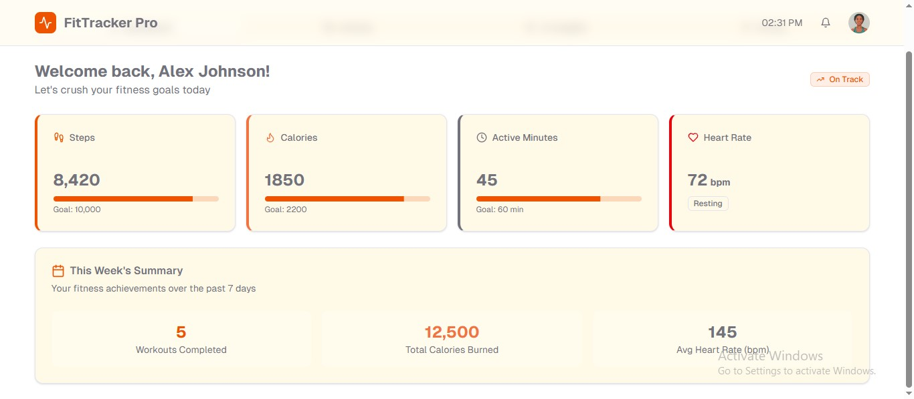
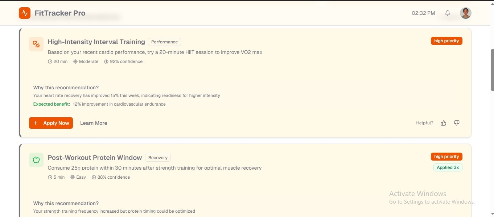

# 🏋️ Fitness Tracker App

A modern full-stack fitness tracking platform that enables users to monitor workouts, visualize fitness progress, and receive AI-powered personalized workout recommendations.

---

## ✨ Features

### 📋 Workout Management

* Log workouts with details such as:

  * Exercise type
  * Duration
  * Intensity level
  * Date and time
* Maintain a complete workout history.

### 📊 Activity Tracking

* View all recorded fitness activities.
* Monitor workout consistency and frequency.
* Access detailed workout records anytime.

### 🤖 AI-Powered Recommendations

* Receive personalized workout suggestions.
* Discover new exercises and fitness routines.
* Get recommendations tailored to your activity history and goals.

### 📈 Progress Visualization

* Analyze workout trends over time.
* Track performance improvements.
* Visualize fitness data through intuitive charts and statistics.

---

## 🖼️ Screenshots

### Dashboard

Overview of recent activities, workout statistics, and progress summaries.



### Personalized Recommendations

AI-generated workout recommendations based on user activity and fitness goals.



---

## 🏗️ Architecture Overview

The application follows a **Microservices Architecture** to ensure scalability, maintainability, and fault isolation.

```text
Client
   │
   ▼
API Gateway
   │
   ├── User Service (PostgreSQL)
   ├── Activity Service (MongoDB)
   └── AI Recommendation Service
            │
            └── OpenAI / Spring AI

Infrastructure:
- Eureka Server
- Config Server
- RabbitMQ
- Apache Kafka
- Docker
```

### 👤 User Service

Responsible for:

* User registration
* Authentication & authorization
* Profile management

**Database:** PostgreSQL

### 🏃 Activity Service

Responsible for:

* Workout tracking
* Activity management
* Fitness history

**Database:** MongoDB

### 🤖 AI Recommendation Service

Responsible for:

* Personalized workout recommendations
* Fitness insights
* Goal-based suggestions

**Tech Stack:** Spring AI + OpenAI

### ⚙️ Config Server

Provides centralized configuration management across all microservices.

### 🔍 Eureka Server

Handles service registration and discovery.

### 🌐 API Gateway

Acts as a single entry point for all client requests and provides:

* Routing
* Security
* Request filtering
* Load balancing

### 📨 Messaging & Event Streaming

#### RabbitMQ

Used for asynchronous communication between microservices.

#### Apache Kafka

Used for:

* Activity event streaming
* Analytics pipelines
* Event-driven workflows

---

## 🛠️ Tech Stack

### Frontend

* React
* Redux
* Material UI

### Backend

* Spring Boot
* Spring Security
* Spring Cloud
* Spring AI

### Databases

* PostgreSQL
* MongoDB

### Infrastructure & DevOps

* Docker
* RabbitMQ
* Apache Kafka
* Eureka Server
* Spring Cloud Config
* API Gateway

---

## 📦 Prerequisites

Before running the project, ensure you have installed:

* Node.js (v14 or later)
* npm or Yarn
* Java 17+
* Maven
* Docker Desktop

---

## 🚀 Getting Started

### 1. Clone the Repository

```bash
git clone https://github.com/your-username/your-repository.git
cd your-repository
```

### 2. Install Frontend Dependencies

Using npm:

```bash
npm install
```

Using yarn:

```bash
yarn install
```

---

## ▶️ Running the Application

### Start the Frontend

```bash
npm start
```

or

```bash
yarn start
```

The application will be available at:

```text
http://localhost:3000
```

### Start Backend Services

Run services in the following order:

1. Config Server
2. Eureka Server
3. API Gateway
4. User Service
5. Activity Service
6. AI Recommendation Service

---

## 🐳 Docker Support

All supporting services are containerized:

* PostgreSQL
* MongoDB
* RabbitMQ
* Kafka

Start infrastructure services using:

```bash
docker-compose up -d
```

---

## 🔮 Future Enhancements

* Wearable device integration
* Real-time activity tracking
* Nutrition tracking
* Social fitness challenges
* Workout achievements and streaks
* Advanced analytics dashboard

---

## 🌹 Thanks for Visiting

Hope you enjoyed exploring this project. If it was worth your time, a star would be much appreciated!


